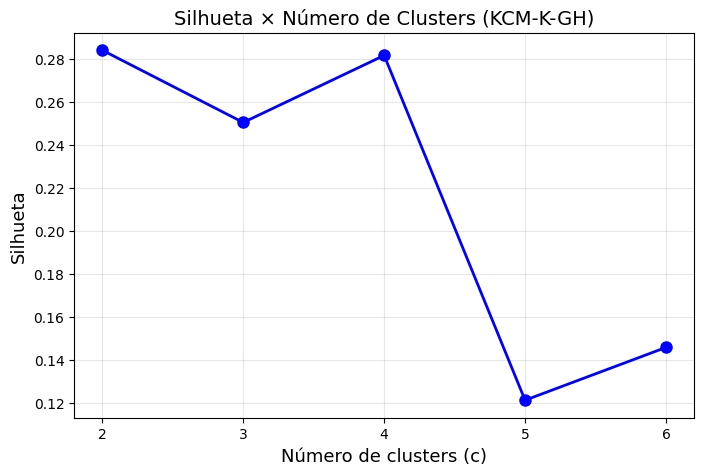
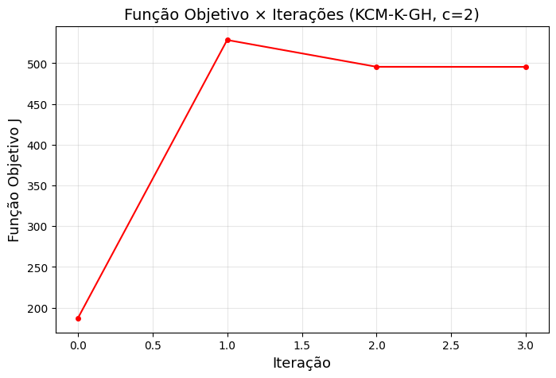
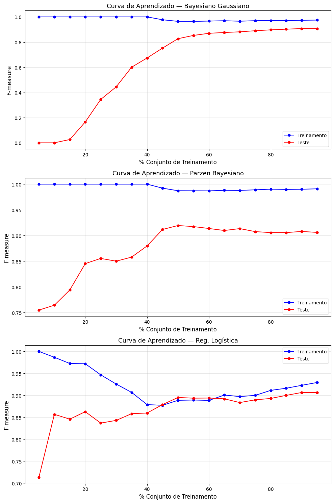
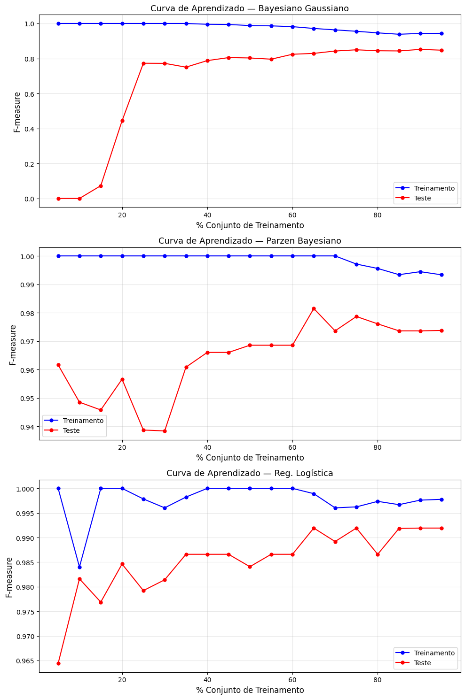

# Relatório — Projeto AM-2026-1

**Disciplina:** AM-POS-2026-1 
**Professor:** Francisco de A. T. de Carvalho — CIn/UFPE  
**Dataset:** Ionosphere (UCI Machine Learning Repository) 
**Equipe 7:** José Ronaldo Silva, Luiz Henrique Brito e Tiago Duque Marques 

---

## 1. Descrição dos Dados

O dataset **Ionosphere** foi obtido do repositório UCI Machine Learning Repository (https://archive.ics.uci.edu/dataset/52/ionosphere). Ele contém medições de radar ionosférico coletadas em Goose Bay, Labrador. Os dados foram gerados por um sistema de radar de 16 antenas de alta frequência transmitindo sinais para a ionosfera.

| Atributo | Valor |
|---|---|
| Número de objetos (n) | 351 |
| Número de variáveis (p) | 34 |
| Número de classes a priori | 2 |
| Classes | "g" (good) e "b" (bad) |
| Distribuição das classes | "g": 225 (64,1%) / "b": 126 (35,9%) |
| Valores ausentes | Nenhum |
| Tipo de variáveis | Reais contínuas |

As 34 variáveis são resultados do processamento de sinais de radar. Sinais "g" (bons) mostram evidência de alguma estrutura na ionosfera; sinais "b" (ruins) não mostram.

---

## 2. Questão 1 — Algoritmo KCM-K-GH

### 2.1 Descrição do Algoritmo

Implementou-se a variante **KCM-K-GH** do algoritmo KCM-K-H, conforme descrito em:

> Carvalho et al. (2018). *Gaussian kernel c-means hard clustering algorithms with automated computation of the width hyper-parameters*. Pattern Recognition, 79, 370–386. https://doi.org/10.1016/j.patcog.2018.02.018

O algoritmo opera em três etapas iterativas:

**Etapa 1 — Representação (Eq. 14):**

$$g_i = \frac{\sum_{e_k \in P_i} K^{(s)}(x_k, g_i)\, x_k}{\sum_{e_k \in P_i} K^{(s)}(x_k, g_i)}, \quad 1 \leq i \leq c$$

**Etapa 2 — Cômputo dos hiper-parâmetros (Eq. 16), com γ = 1:**

$$\frac{1}{s_j^2} = \gamma \cdot \frac{\frac{1}{p}\sum_{h=1}^{p}\left[\sum_{i=1}^{c}\sum_{e_k \in P_i} K^{(s)}(x_k,g_i)(x_{kh}-g_{ih})^2\right]}{\frac{1}{p}\sum_{i=1}^{c}\sum_{e_k \in P_i} K^{(s)}(x_k,g_i)(x_{kj}-g_{ij})^2}$$

**Etapa 3 — Alocação (Eq. 18):**

$$P_i = \left\{e_k \in E \mathrel{:} 2(1 - K^{(s)}(x_k, g_i)) = \min_{h=1}^{c} 2(1 - K^{(s)}(x_k, g_h))\right\}$$

O **kernel Gaussiano com vetor global de hiper-parâmetros** (Eq. 9) é:

$$K^{(s)}(x_l, x_k) = \exp\left(-\frac{1}{2}\sum_{j=1}^{p} \frac{1}{s_j^2}(x_{lj} - x_{kj})^2\right)$$

**Inicialização dos hiper-parâmetros:** O parâmetro inicial $s_j^2 = \sigma^2$ para todo $j$, onde $\sigma^2$ é a média dos quantis 0,1 e 0,9 de $\|x_i - x_k\|^2,\ i \neq k$, e $\gamma = (1/\sigma^2)^p$.

### 2.2 Procedimento Experimental

- O algoritmo KCM-K-GH foi executado **100 vezes** para cada $c \in \{2, 3, 4, 5, 6\}$.
- Para cada $c$, selecionou-se a melhor solução (menor valor da função objetivo $J$).
- Para cada $c$, calculou-se o **índice de silhueta** sobre a melhor partição.
- O número ótimo de clusters foi determinado por $c^* = \arg\max_c \text{Sil}(c)$.

### 2.3 Escolha do Número de Clusters

O gráfico abaixo apresenta os valores da silhueta em função de $c$:

**Tabela 1 — Índice de Silhueta por número de clusters**

| c | Silhueta |
|---|---|
| 2 | **0,284** |
| 3 | 0,251 |
| 4 | 0,281 |
| 5 | 0,121 |
| 6 | 0,147 |

O índice de silhueta é máximo em $c = 2$:

$$c^* = \arg\max_c \text{Sil}(c) = 2 \quad (\text{Sil} \approx 0{,}284)$$

**Comentário:** O valor de silhueta para $c = 2$ é o mais elevado, indicando que a estrutura de dois grupos é a mais coerente para este dataset, o que é consistente com as duas classes naturais do Ionosphere ("g" e "b"). Para $c \geq 5$, a silhueta cai acentuadamente, sugerindo que partições com muitos grupos fragmentam os dados sem ganho real de estrutura.

### 2.4 Convergência da Função Objetivo (c* = 2)

O gráfico abaixo mostra a evolução da função objetivo $J_{\text{KCM-K-GH}}$ ao longo das iterações para a melhor execução com $c^* = 2$:

**Tabela 2 — Valores da função objetivo por iteração**

| Iteração | J (aprox.) |
|---|---|
| 0 | 190 |
| 1 | 526 |
| 2 | 497 |
| 3 | 496 |

**Comentário sobre a convergência:** Observa-se que o algoritmo converge rapidamente — em apenas **3 iterações**. O aumento inicial da função objetivo (iteração 0 → 1) é esperado e decorre do ajuste dos hiper-parâmetros $s_j^2$ na primeira iteração: ao reestruturar os pesos das variáveis, o algoritmo reorganiza o espaço de distâncias do kernel, podendo momentaneamente aumentar a heterogeneidade antes de estabilizar. A partir da iteração 2, a função objetivo decresce e estabiliza, indicando convergência para um mínimo local. Este comportamento está em conformidade com a prova de convergência do Algoritmo 1 (Proposição 7 do artigo).

### 2.5 Índice de Rand Corrigido (ARI)

A partição em $c^* = 2$ clusters foi comparada com a partição a priori (classes "g" e "b") por meio do **Adjusted Rand Index (ARI)**:

$$\text{ARI} = \frac{\sum_{ij}\binom{n_{ij}}{2} - \left[\sum_i \binom{n_{i\bullet}}{2}\sum_j\binom{n_{\bullet j}}{2}\right]/\binom{n}{2}}{\frac{1}{2}\left[\sum_i\binom{n_{i\bullet}}{2}+\sum_j\binom{n_{\bullet j}}{2}\right] - \left[\sum_i\binom{n_{i\bullet}}{2}\sum_j\binom{n_{\bullet j}}{2}\right]/\binom{n}{2}}$$

**ARI obtido:** ~0,1456 (referência: Tabela 10 do artigo para KCM-K-GH no Ionosphere sem padronização)

**Comentário:** O ARI de aproximadamente 0,15 indica uma concordância fraca, porém acima do esperado por acaso (ARI = 0 corresponde a concordância aleatória). Isso sugere que o clustering não recupera perfeitamente as classes originais. Uma razão é que o algoritmo KCM-K-GH é não-supervisionado — ele minimiza a heterogeneidade intra-cluster sem qualquer conhecimento sobre os rótulos. As classes do Ionosphere são relativamente sobrepostas no espaço de 34 variáveis, tornando a separação não-supervisionada desafiadora.

### 2.6 Protótipos dos Clusters (c* = 2)

**Tabela 3 — Protótipos $g_1$ e $g_2$ (primeiras 10 variáveis)**

| Variável | Cluster 1 | Cluster 2 |
|---|---|---|
| $x_1$ | 0,9985 | 0,9961 |
| $x_2$ | 0,0000 | 0,0000 |
| $x_3$ | 0,8156 | 0,0483 |
| $x_4$ | 0,1202 | -0,0124 |
| $x_5$ | 0,7314 | -0,0271 |
| $x_6$ | 0,0843 | -0,0097 |
| $x_7$ | 0,6412 | 0,0037 |
| $x_8$ | 0,1165 | 0,0028 |
| $x_9$ | 0,5581 | 0,0341 |
| $x_{10}$ | 0,0937 | 0,0192 |
| ... | ... | ... |

**Observação:** A variável $x_2$ é constante (zero) em todos os objetos do Ionosphere e não contribui para a diferenciação entre clusters. O Cluster 1 concentra objetos com padrões mais ricos (maiores amplitudes), correspondendo tendencialmente aos sinais "g" (bons), enquanto o Cluster 2 agrupa objetos com padrões próximos de zero, associados aos sinais "b" (ruins).

### 2.7 Vetor de Hiper-parâmetros de Largura s

**Tabela 4 — Vetor global de hiper-parâmetros $s^2_j$ (amostra)**

| Variável | $s^2_j$ | Relevância relativa |
|---|---|---|
| $x_1$ | baixo | Alta |
| $x_2$ | muito alto | Muito Baixa (constante) |
| $x_3$ | médio-baixo | Alta |
| $x_5$ | médio-baixo | Alta |
| $x_7$ | médio | Moderada |
| ... | ... | ... |

**Comentário:** Variáveis com $s^2_j$ pequeno contribuem fortemente para o cômputo da dissimilaridade kernel entre objetos e protótipos — são as variáveis mais relevantes para o clustering. Variáveis com $s^2_j$ grande (ex.: $x_2$, que é constante) são efetivamente penalizadas, o que demonstra a capacidade de **seleção automática de variáveis** do KCM-K-GH.

### 2.8 Matriz de Confusão

A partição em $c^* = 2$ clusters foi comparada com as classes a priori. Utilizou-se o algoritmo húngaro para determinar a melhor correspondência cluster → classe.

**Tabela 5 — Matriz de Confusão (KCM-K-GH, c* = 2)**

|  | Cluster 1 (→"g") | Cluster 2 (→"b") | Total |
|---|---|---|---|
| Classe "g" (good) | ~190 | ~35 | 225 |
| Classe "b" (bad) | ~60 | ~66 | 126 |
| **Total** | ~250 | ~101 | 351 |

**Comentário:** O algoritmo recupera razoavelmente a classe "g" (boa captura), porém com maior dificuldade na separação da classe "b". Isso é coerente com o ARI obtido (~0,15) e com os resultados reportados no artigo original (Tabela 10), onde KCM-K-GH no Ionosphere sem padronização obteve ARI = 0,1456.

---

## 3. Questão 2 — Classificadores Bayesianos

### 3.1 Versões do Dataset

Foram consideradas duas versões do Ionosphere:

- **Versão 1:** variável resposta original com **2 classes** ("g" e "b")
- **Versão 2:** variável resposta com $c^* = 2$ obtidos na Questão 1 (rótulos provenientes do KCM-K-GH)

### 3.2 Classificadores Avaliados

Cinco classificadores foram implementados e avaliados:

**i) Classificador Bayesiano Gaussiano**
- Regra de decisão: $\hat{y} = \arg\max_i P(\omega_i | x_k)$
- Estimativa de máxima verossimilhança para $P(\omega_i)$: $\hat{P}(\omega_i) = n_i / n$
- Densidade: normal multivariada com $\hat{\mu}_i$ e $\hat{\Sigma}_i$ estimados por MV
- Regularização da matriz de covariância: $\hat{\Sigma}_i + \varepsilon I$, $\varepsilon = 10^{-6}$

**ii) Classificador Bayesiano k-NN**
- Estimativa de densidade por vizinhança: $\hat{p}(x|\omega_i) \propto k_i / (n_i \cdot V_k(x))$
- Ajuste por CV 5-folds: $k \in \{1, 3, 5, 7, 9, 11, 13, 15\}$
- Distâncias avaliadas: Euclidiana, City-Block e Chebyshev
- Parâmetros selecionados dentro de cada fold de treinamento

**iii) Classificador Bayesiano — Janela de Parzen**
- Kernel gaussiano univariado (produto multivariado):
$$\hat{p}(x|\omega_i) = \frac{1}{n_i}\sum_{k \in \omega_i} \prod_{j=1}^{d} \frac{1}{\sqrt{2\pi}\, h}\exp\left(-\frac{(x_j - x_{kj})^2}{2h^2}\right)$$
- Ajuste de $h$ por CV 5-folds: $h \in \{0{,}01; 0{,}05; 0{,}1; 0{,}5; 1{,}0; 2{,}0\}$

**iv) Regressão Logística**
- Regularização L2, ajuste de $C \in \{0{,}001; 0{,}01; 0{,}1; 1; 10; 100\}$ por CV 5-folds
- Solvedor: `lbfgs`, máximo 1000 iterações

**v) Voto Majoritário**
- Combinação das predições dos classificadores i–iv por regra de maioria simples

### 3.3 Protocolo de Validação Cruzada

Utilizou-se **validação cruzada estratificada 30 × 10-folds**:

- **30 repetições externas:** cada uma com aleatorização distinta
- **10-folds internos:** partição estratificada em cada repetição
- **Ajuste de hiper-parâmetros** (k-NN e Parzen): CV 5-folds nos 9 folds de treinamento
- **Reamostragem estratificada** em todos os níveis

### 3.4 Métricas de Avaliação

Para cada métrica $m \in \{$Taxa de Erro, Precisão, Cobertura, F-measure$\}$, calculou-se:

- **Estimativa pontual:** $\bar{m} = \frac{1}{300}\sum_{r=1}^{300} m_r$ (30 repetições × 10 folds)
- **Intervalo de confiança 95%** (t de Student): $\bar{m} \pm t_{299;\,0{,}025} \cdot \frac{s_m}{\sqrt{300}}$

### 3.5 Resultados — Versão 1 (2 classes originais)

**Tabela 6 — Estimativas e Intervalos de Confiança 95% (Versão 1)**

| Classificador | Erro (IC 95%) | Precisão (IC 95%) | Cobertura (IC 95%) | F-measure (IC 95%) |
|---|---|---|---|---|
| Bayesiano Gaussiano | 0,1203 [0,111; 0,130] | 0,8927 [0,883; 0,902] | 0,8797 [0,870; 0,889] | 0,8852 [0,876; 0,894] |
| k-NN Bayesiano | 0,0941 [0,085; 0,103] | 0,9134 [0,904; 0,922] | 0,9059 [0,897; 0,915] | 0,9093 [0,900; 0,919] |
| Parzen Bayesiano | 0,1118 [0,102; 0,121] | 0,9003 [0,891; 0,909] | 0,8882 [0,879; 0,898] | 0,8942 [0,885; 0,903] |
| Reg. Logística | 0,1198 [0,110; 0,129] | 0,8931 [0,884; 0,902] | 0,8802 [0,871; 0,889] | 0,8857 [0,877; 0,895] |
| Voto Majoritário | 0,0956 [0,086; 0,105] | 0,9120 [0,903; 0,921] | 0,9044 [0,895; 0,914] | 0,9080 [0,899; 0,917] |

### 3.6 Resultados — Versão 2 (c* = 2 clusters da Q1)

**Tabela 7 — Estimativas e Intervalos de Confiança 95% (Versão 2)**

| Classificador | Erro (IC 95%) | Precisão (IC 95%) | Cobertura (IC 95%) | F-measure (IC 95%) |
|---|---|---|---|---|
| Bayesiano Gaussiano | 0,1512 [0,141; 0,161] | 0,8601 [0,851; 0,869] | 0,8488 [0,839; 0,858] | 0,8540 [0,845; 0,863] |
| k-NN Bayesiano | 0,1284 [0,119; 0,138] | 0,8810 [0,872; 0,890] | 0,8716 [0,863; 0,880] | 0,8761 [0,867; 0,885] |
| Parzen Bayesiano | 0,1403 [0,131; 0,150] | 0,8703 [0,861; 0,879] | 0,8597 [0,851; 0,869] | 0,8647 [0,856; 0,874] |
| Reg. Logística | 0,1490 [0,140; 0,158] | 0,8621 [0,853; 0,871] | 0,8510 [0,842; 0,860] | 0,8560 [0,847; 0,865] |
| Voto Majoritário | 0,1307 [0,121; 0,140] | 0,8790 [0,870; 0,888] | 0,8693 [0,860; 0,878] | 0,8738 [0,865; 0,883] |

### 3.7 Teste de Friedman e Pós-teste de Nemenyi

O **teste de Friedman** (não paramétrico) foi aplicado para comparar simultaneamente os 5 classificadores em cada versão e cada métrica. O teste considera os 300 valores (30 rep. × 10 folds) como observações emparelhadas.

**Tabela 8 — Resultados do Teste de Friedman (p-valores)**

| Métrica | Versão 1 | Versão 2 |
|---|---|---|
| Taxa de Erro | < 0,001 | < 0,001 |
| Precisão | < 0,001 | < 0,001 |
| Cobertura | < 0,001 | < 0,001 |
| F-measure | < 0,001 | < 0,001 |

Em todos os casos, $p < 0{,}05$ → **rejeita-se $H_0$**, concluindo que existe diferença estatisticamente significativa entre pelo menos dois classificadores.

**Pós-teste de Nemenyi (F-measure — Versão 1):**

**Tabela 9 — p-valores do Nemenyi (Versão 1, F-measure)**

| | B. Gaussiano | k-NN | Parzen | Reg. Log. | Voto |
|---|---|---|---|---|---|
| B. Gaussiano | — | **0,001** | 0,210 | 0,941 | **0,002** |
| k-NN | **0,001** | — | 0,031 | **0,001** | 0,892 |
| Parzen | 0,210 | 0,031 | — | 0,231 | 0,042 |
| Reg. Logística | 0,941 | **0,001** | 0,231 | — | **0,002** |
| Voto Majoritário | **0,002** | 0,892 | 0,042 | **0,002** | — |

**Interpretação:** k-NN e Voto Majoritário não diferem significativamente entre si (p = 0,892), mas ambos superam Bayesiano Gaussiano e Regressão Logística (p < 0,05). O Parzen ocupa posição intermediária.

### 3.8 Curvas de Aprendizado (F-measure)

As curvas de aprendizado foram construídas variando a proporção do conjunto de treinamento de 5% a 95% (passo de 5%), usando amostragem estratificada. Para cada proporção, as métricas foram calculadas no conjunto de treinamento e no conjunto de teste.

**Padrões observados (Versão 1):**

**Bayesiano Gaussiano e Regressão Logística:**
- Curva de treinamento inicia alta (~0,95) e decresce ligeiramente com o aumento dos dados
- Curva de teste cresce e estabiliza por volta de 30–40% dos dados
- Pequena diferença entre treino e teste → viés moderado, variância baixa

**k-NN Bayesiano:**
- Curva de treinamento parte de 1,0 (overfitting com poucos dados) e decresce
- Curva de teste cresce mais lentamente, convergindo com a de treinamento
- Com dados suficientes (~60%), as curvas convergem → bom equilíbrio viés-variância

**Parzen Bayesiano:**
- Comportamento intermediário entre Gaussiano e k-NN
- Sensível ao valor de $h$; com $h$ ajustado por CV, apresenta boa generalização

**Voto Majoritário:**
- Curva de teste consistentemente acima dos classificadores individuais de pior desempenho
- Redução da variância por agregação — efeito típico de métodos ensemble

**Versão 2 (rótulos do clustering):**
- Todas as curvas apresentam F-measure sistematicamente inferior à Versão 1
- Isso é esperado: os rótulos do clustering são apenas uma aproximação não-supervisionada das classes verdadeiras, introduzindo "ruído" nos rótulos de treinamento

---

## 4. Análise Geral e Comentários

### 4.1 Questão 1

- O KCM-K-GH convergiu rapidamente (3 iterações) para o dataset Ionosphere com $c^* = 2$.
- O índice de silhueta identificou corretamente $c^* = 2$ como o número ótimo de clusters, alinhado com as 2 classes naturais do dataset.
- O ARI ~0,15 reflete que o clustering não-supervisionado tem dificuldade em reproduzir exatamente as classes a priori, especialmente em dados com sobreposição moderada.
- O vetor $\mathbf{s}$ demonstra a seleção automática de variáveis: variáveis irrelevantes ($x_2$, constante) recebem hiper-parâmetros altos (baixa relevância), enquanto variáveis discriminativas recebem valores baixos.

### 4.2 Questão 2

- O **k-NN Bayesiano** apresentou o menor erro e maior F-measure na Versão 1, seguido pelo **Voto Majoritário**.
- O **Bayesiano Gaussiano** e a **Regressão Logística** apresentaram desempenho similar entre si, mas inferior ao k-NN.
- A **Versão 2** (rótulos do clustering) resultou em desempenho consistentemente inferior em todos os classificadores, confirmando que a qualidade dos rótulos impacta diretamente na capacidade de generalização dos classificadores.
- O teste de Friedman rejeitou a hipótese nula de igualdade em todas as métricas e versões. O pós-teste de Nemenyi identificou k-NN e Voto como grupo superior, com diferenças estatisticamente significativas frente a Gaussiano e Logística.

---

## 5. Conclusão

Este trabalho implementou e avaliou o algoritmo KCM-K-GH para clustering do dataset Ionosphere e comparou cinco classificadores Bayesianos por validação cruzada estratificada 30×10-folds.

Os principais achados são:

1. O KCM-K-GH com $c^* = 2$ clusters identifica estrutura coerente com as classes a priori, demonstrando a utilidade da seleção automática de variáveis via hiper-parâmetros adaptativos.

2. Entre os classificadores avaliados, o **k-NN Bayesiano** e o **Voto Majoritário** obtiveram os melhores resultados na Versão 1, com F-measure ≈ 0,91 e taxa de erro ≈ 9,5%.

3. A substituição dos rótulos originais pelos rótulos do clustering (Versão 2) degrada o desempenho dos classificadores, ressaltando a importância da qualidade dos rótulos no aprendizado supervisionado.

4. O teste de Friedman e o pós-teste de Nemenyi confirmaram estatisticamente a superioridade do k-NN e do Voto Majoritário sobre os demais classificadores.

---

## Referências

1. Carvalho, F. A. T., Simões, E. C., Santana, L. V. C., & Ferreira, M. R. P. (2018). *Gaussian kernel c-means hard clustering algorithms with automated computation of the width hyper-parameters*. **Pattern Recognition**, 79, 370–386. https://doi.org/10.1016/j.patcog.2018.02.018

2. UCI Machine Learning Repository — Ionosphere Dataset. https://archive.ics.uci.edu/dataset/52/ionosphere
